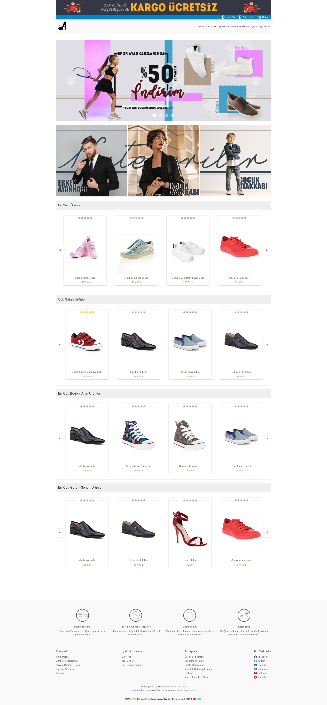
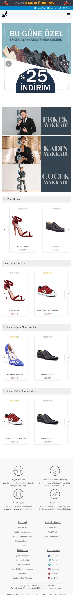

# Merhabalar 
Btk akademi PHP eğitim (Eğitmen Volkan Alakent ) projesi olarak tasarladığım web sitesi kodlarını sizlerle paylaşmaktayım.

Yönetim Paneline resim yüklemek :
## 1-üst Banner:  
Anasayfanın en üstündeki banner alanına resim eklemek için Banner alanı -> Anasayfa Üst seçilmelidir. 
Resim arkaplanı varsayılan olarak #353745 kodlu renktir. Eğer transparan bir png yükleme yaparsanız bu renge göre tasarım yapmanız gerekmektedir. Eğer isterseniz img veya gif dosyası tasarlayıp bu arka plan rengine bağlı kalmadan da dosya yükleyebilirsiniz. 
GenişlikxYükseklik : 1064x60 olarak ayarlanmalıdır. 

## 2-Slider resimleri : 
Slider Web görünüm için resim yükleme : Banner alanı -> Anasayfa, 
Slider Mobil görünüm için resim yükleme : Banner alanı -> Anasayfa Mobil seçilmelidir. 
Herhangi bir arkaplan rengi tanımlanmadı ancak png transparan arkaplanlı resim yüklemenizi tavsiye etmem slayt geçişlerinde resimlerin üst üste binmesini sağlayacaktır.
Slider resim gösterim sırası eğitimdeki gibi veritanı hit güncelleme yöntemiyle geliyor yani en az gösterim sayısı olan slider resmi sayfa yüklendiğinde ilk sırada gösterilecek şekilde ayarladım. Slayt süresi 4 sn.’dir app.js dosyasında açıklamalarıyla kodları yazdım istenirse güncellenebilir.
Web görünüm GenişlikxYükseklik : 1064x400
Mobil görünüm GenişlikxYükseklik : 1:1 oranındadır. Yani genişlik yükseklik aynı boyda olduğu sürece boyut fark etmez. Ancak büyük boyutlarda resim yüklemenizi tavsiye etmem sitenin yavaş yüklenmesine neden olacaktır. Tavsiyem 500x500 96 dpi ki zaten o şekilde ayarladım yüksek boyut bile yükleseniz site yükleme yaparken boyut düşürecektir. Çok boyutlu dosya yüklemeniz yine bir eksi olacaktır Fotoğraf çözünürlük ne kadar büyük boyuttan düşerse o kadar kötü gözükür. 

## 3- Kategori resimleri : 
Web Görünüm Resim yükleme : Banner alanı -> Anasayfa Kategoriler,
Mobil Görünüm Resim Yükleme : Banner alanı -> Anasayfa Kategoriler Mobil  seçilmelidir. 
istenildiği kadar yükleme yapılabilir. Kategori arttıkça buraya fazladan resim eklenebilir. Site erkek, kadın, çocuk olarak örnek tasarlandı eğer 3 kategori kalsın istenirse bir kere yükleme yaptıktan sonra tekrar yükleme yapmaya gerek yok güncelleme yapılabilir. 
Web Görünüm GenişlikxYükseklik : 1:1 oranındadır. Tavsiyem 350x350 96 dpi 
Mobil Görünüm GenişlikxYükseklik : 500x200
img, png, gif olarak yükleme yapılabilir. 
Kategori resimleri link olarak tasarlandı yani erkek kategorisine tıkladığınızda erkek ayakkabıları sayfasına yönlendirilirsiniz. Ancak bunun çalışması için Kategori resmi yüklerken açıklamaya kategori ismini belirtmeniz gerekiyor. Eğer tasarımımı alıp siteyi başka bir ürün için kullanmak isterseniz tasarımda kategorileri(kodlar dahil) buna göre düzenlemeniz gerekecektir. 
## 4- Ürün resmi : 
GenişlikxYükseklik = 600x800, oranlı olarak daha büyük boyutlar istenirse eklenebilir. 
jpeg, jpg yüklenebilir. 
Ürün resmi ekleme Ana menü -> Ürünler -> Ürün ekle butonundan yapılabilir. 

[buradan](https://btkegitimeticaret.great-site.net/) tasarımı inceleyebilirsiniz. 

### masaüstü önizleme(görünüm) : 

### mobile önizleme(görünüm) : 

